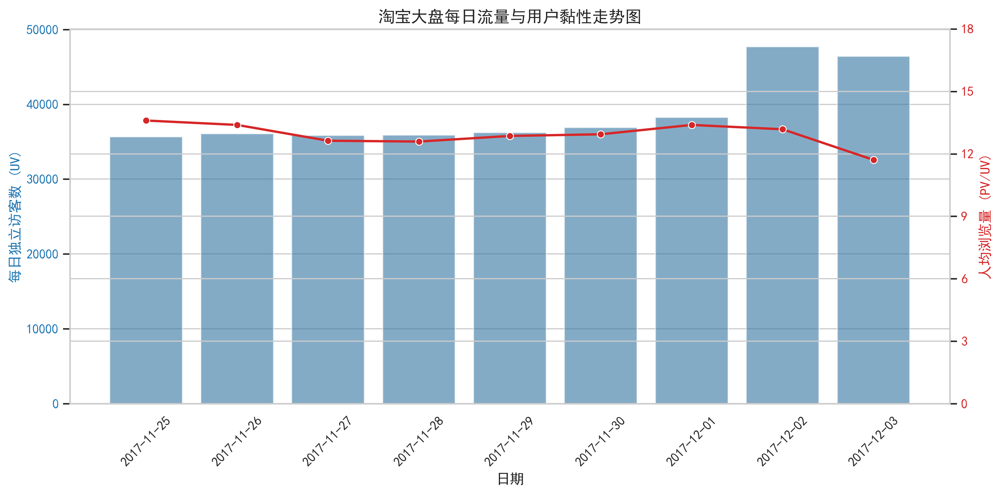
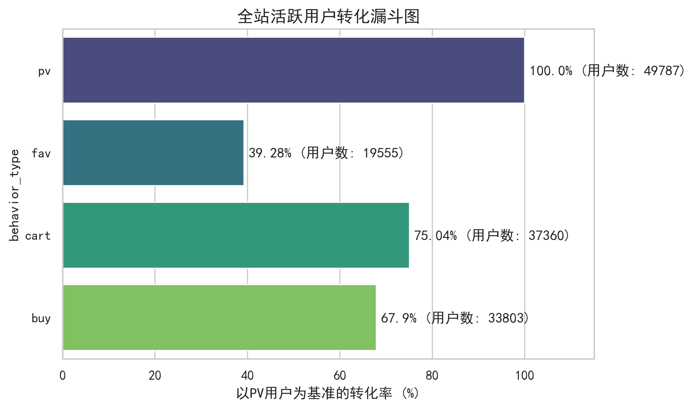
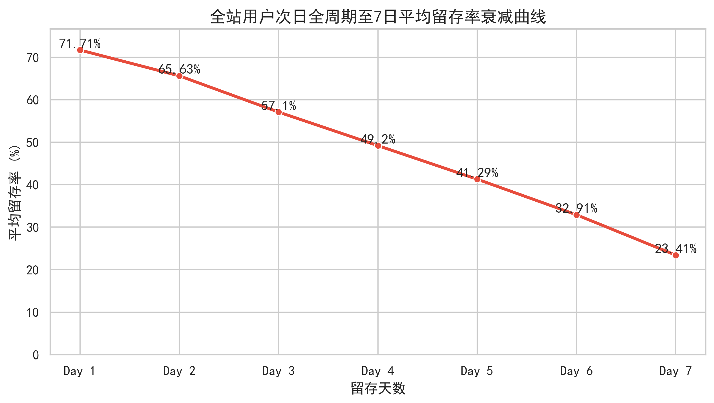
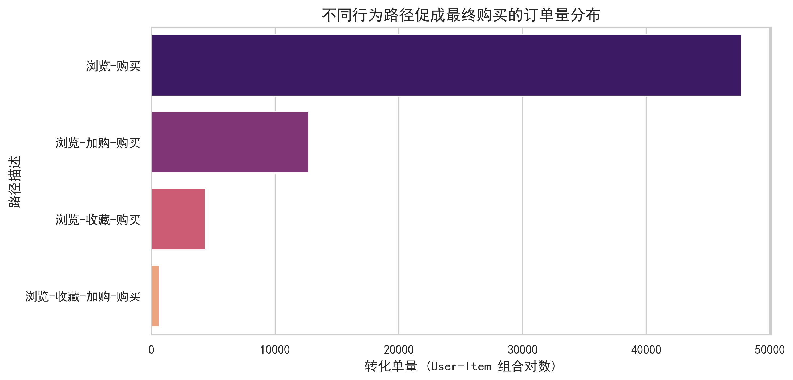
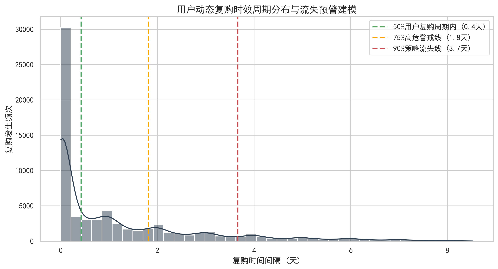
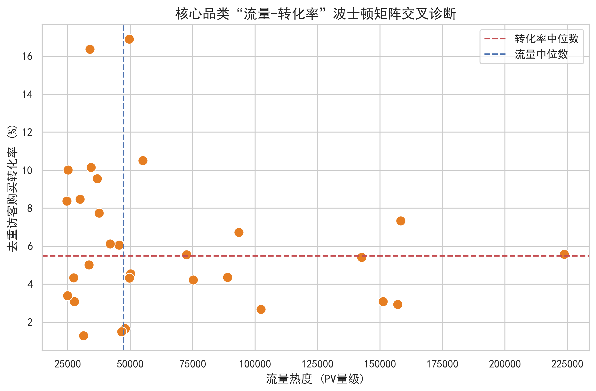
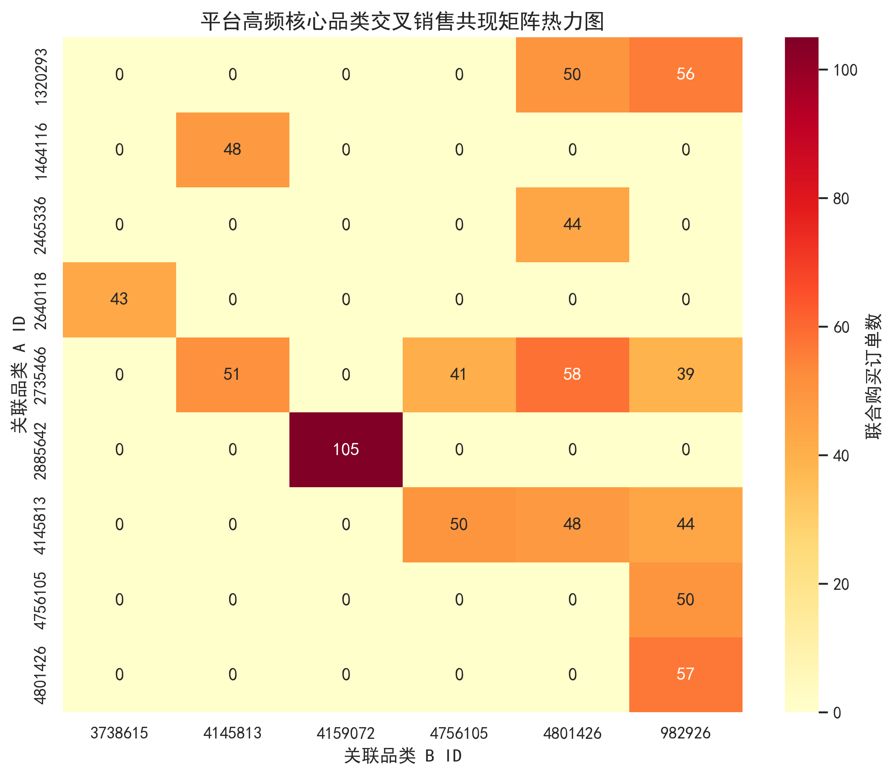

# 淘宝用户行为分析

## 数据
- 来源：UserBehavior.csv（2017-11-25 至 2017-12-03）
- 采样：5 万随机用户
- 行为类型：点击、收藏、加购、购买

## 技术栈
Python · Pandas · NumPy · Matplotlib · Seaborn

## 分析模块
1. **流量、时序与转化漏斗**  
   - 每日 UV/PV 及人均 PV 趋势
     
   - 24 小时行为分布
     
   - 全站浏览→购买转化漏斗
     

2. **用户留存与动态复购**  
   - 次日～7 日留存衰减曲线
     
   - 购买行为路径分布
     
   - 复购周期分布与流失预警线
      

3. **精细化 CRM 与品类诊断**  
   - RF 客户分层（价值/忠诚/潜力/流失风险）  
   - 品类流量-转化波士顿矩阵
     
   - 高频品类交叉销售共现矩阵
     

## 项目文件树
```text
taobao_analysis/
├── notebook/                       # Jupyter 数据分析
│   ├── traffic_timeseries.ipynb # 流量、时序与大盘转化率分析
│   ├── retention_path.ipynb     # 用户流失、留存与动态复购策略
│   └── rfm_products.ipynb       # 精细化CRM分层、商品爆款诊断与交叉销售
├── preprocessing.py # 数据清洗、采样与底表生成
└── outputs/ 
    ├── 01_daily_traffic_trend.png
    ├── 02_hourly_behavior_timeseries.jpg
    ├── 03_user_conversion_funnel.png
    ├── 04_retention_decay_curve.png
    ├── 05_behavior_path_distribution.png
    ├── 06_repurchase_interval_model.png
    ├── 07_category_bcg_matrix.png
    └── 08_cross_selling_heatmap.png
